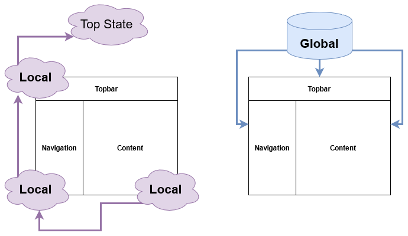
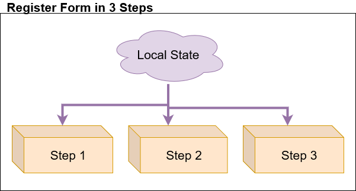
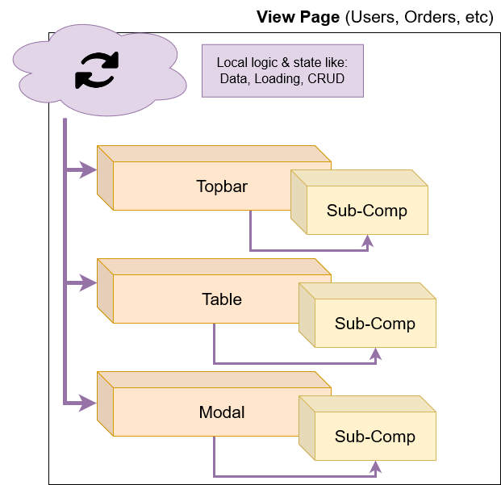
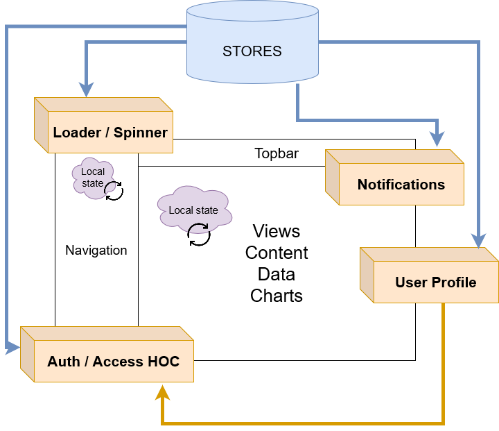
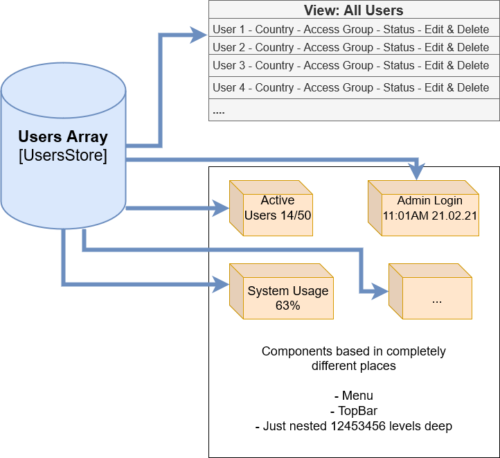
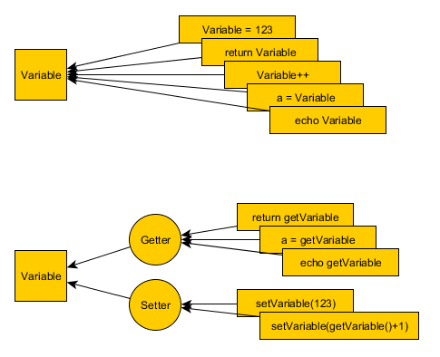
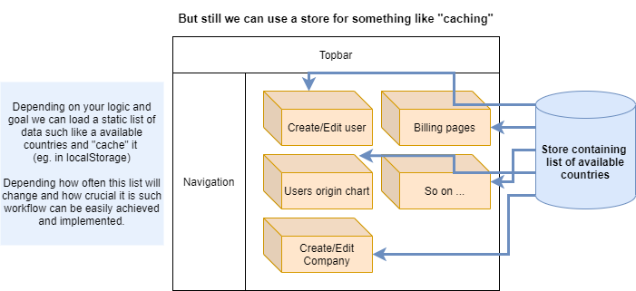

# State Management


[Slides Live](https://state-management-meeting.netlify.app/) | [Slides Repo](https://github.com/simeon-petrov-5/state-management-meeting)

----------


# State Management

On today's news
- What's state? What's global state || state management tool?
- Local vs Global state (when to actually use it)?
- How to keep it manageable?
- But the data cache ... 

----------

# Some points to clarify

## Depends ... Depends ... Depends ...
## Depends ... Depends ... Depends ...


```
BTW did I mention that it depends on ...
```

TL;DR - Almost everything depends on the situation and I woudn't say this is set in stone.

----------

# State? Local? Global?



----------

# The libraries

### Redux, MobX, Zustand, Recoil, XState/State Machines, Vuex ....
----------

# Probably you don't even need it

## React Context API

## Vue Composition API
----------
# Some of the more "less positive" experience

Often, I've seen people using global state to store stuff that don't need to be stored there. Such like:

- Storing the data from the server (sometimes also trying to cache it)
- Storing ALL the state of the app
- Gathering everything in a single store
----------

# Local State Usage
- Page loading
- Different components loading state
- Data lists
- Expanded state
- More or less, everything can be here.

----------

# Local State Usage - Same level
Let's say we have a form for registering new users with 3 specific steps one after another. This can easily be created with local and encapsulated state.

--


----------

# Local State Usage - Nested level


----------

# Local State Usage - Nested level
- We can make Smart & Dumb architecture
- We can drill the state as props for a level or two and lift it up whenever needed
- **Can** totally use a store if the nesting is too deep (still not required tho)


----------

# Global State Usage




----------

### Global State Usage



----------

# Global State 

Whenever ...
- multiple components have to access the state/data
- is easier to maintain connection beween Parent & Child components
- you need to trigger "same" actions in multiple components/places *
> *This highly depends on the code base, but still.


### But please, please, please don't fall in the rabbit hole of premature-optimisation.

----------
# But how to actually ... use it.

It's kind of simple
1. Getter & Setter
2. Modules
----------
# 1. Getter & Setter

- No direct manipulation/assigning to the variable
- Easy to trace & debug



----------
# 1.1. Getter & Setter - Implementation

```
export default {
    state: {
        userData: { ...initialUserState } // initialUserState - object with empty fields
    },
    getters: {
        userData(state) {
            return state.userData
        }
    },
    mutations: {
        resetUserState(state) {
            state.userData = { ...initialUserState };
        },
        setUser(state, newUser) {
            state.userData = newUser
        }
    },
    actions: {
        async getUser(context, userId) {
            const res = await axios.get(`https://some-api/api/users/${userId}`);
            context.commit('setUser', res.data);
        }
    }
}
```
----------
# 1.2. Getter & Setter - In component

```
methods: {
  async loadUser(userId) {
    await store.dispatch("usersModule/getUser", userId);
  },

  getUser() {
    store.getters("usersModule/userData");
  },

  updateUser(newData) {
    store.commit("usersModule/setUser", newData);
  },

  reset() {
    store.commit("resetUserState");
  }
}
```
----------
# 1.3. Easy to debug


----------
# 2. Modules

Split stores into modules
- Easier to work with & maintain
- Lazy Loading / Code Splitting / Performance

### Example structure
```
├── store
│   ├── index.js // The entry point for all stores
│   ├── users.js
│   ├── calendar.js
│   └── notifications.js
```
----------

# 2.1. Module Implementation
### Admin.vue
```
import adminModule from './admin.js'

export default { 
  mounted () { 
    store.registerModule('admin', adminModule)
  },
  beforeDestroy () {
    store.unregisterModule('admin')
  }
}
```

[Vue.js App Performance Optimization: part 3— Lazy loading Vuex modules](https://itnext.io/vue-js-app-performance-optimization-part-3-lazy-loading-vuex-modules-ed67cf555976)

----------

# persist or "cache data" with a store

Depends on what you want to achieve, how importand and dynamic the data is and what workflow we have.




----------

# Server vs UI

Server State 
- what we get from our server
- can be cached for faster usability (more on that later)

UI State 
- what we use/present/build our pages
- stored on the client - on refresh - poof, begone

> Server State !== UI State

----------

# Server vs UI

Stores are often used for storing the server data - as a cache machinsm in the frontend for faster loading, interactions, etc. Also sometimes persisting the whole store data inside let's say localStorage.

But this can bring a whole new set of issues by itself alone - cleaning "cache", managing "cache", resetting "cache", expiration of this "cache" and so on. 

Modules that actually do that and handle all that additional bloatware

- [react query](https://react-query.tanstack.com/)
- [SWR](https://swr.vercel.app/) or [SWRV](https://github.com/Kong/swrv)
- [Apollo Client](https://www.apollographql.com/docs/react/caching/cache-configuration/)
- [URQL](https://formidable.com/open-source/urql/)


----------

# Recap

- Keep it simple and don't overuse it
- Whenever you need a store - use it
- Whenever a local state is enough - it's more than enough
- Use things as they're intended

----------

# Resources

[Managing React Application State Management - Talk by Kent C. Dodds](https://www.youtube.com/watch?v=zpUMRsAO6-Y)
[How I Manage State in React - Leigh Halliday](https://www.youtube.com/watch?v=FzlurzsCW4M)
[React Apollo State Management Best Practices -  Ben Awad](https://www.youtube.com/watch?v=N2q-ZYuQWI8)